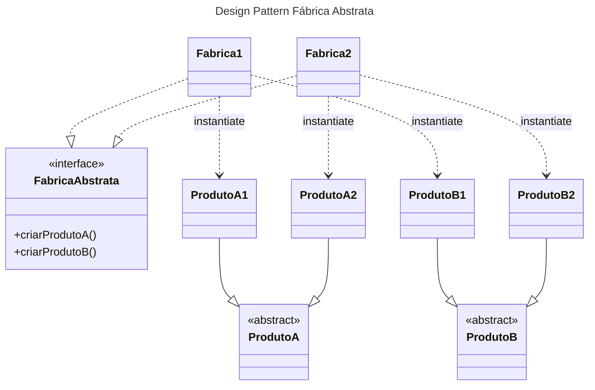

```mermaid
---
title: Design Pattern Fábrica Abstrata
---
classDiagram
    class FabricaAbstrata {
        <<interface>>
        +criarProdutoA()
        +criarProdutoB()
    }
    class Fabrica1
    class Fabrica2

    Fabrica1 ..|> FabricaAbstrata
    Fabrica2 ..|> FabricaAbstrata

    class ProdutoA {
        <<abstract>>
    }
    class ProdutoA1
    class ProdutoA2

    class ProdutoB {
        <<abstract>>
    }
    class ProdutoB1
    class ProdutoB2

    ProdutoA1 --|> ProdutoA
    ProdutoB1 --|> ProdutoB
    ProdutoA2 --|> ProdutoA
    ProdutoB2 --|> ProdutoB

    Fabrica1 ..> ProdutoA1 : instantiate
    Fabrica1 ..> ProdutoB1 : instantiate
    Fabrica2 ..> ProdutoA2 : instantiate
    Fabrica2 ..> ProdutoB2 : instantiate
```
